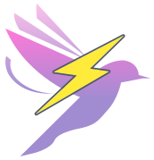

<div align="center">
  <a href="/">
	
  </a>
  <h1>Versakit</h1>
  <p>A modern component library ecosystem for web applications</p>
  <p>
    <a href="">Documentation</a> | 
    <a href="./README.zh-CN.md">中文</a>
  </p>
  <p>
    
  </p>
</div>

---

## Introduction

Versakit is a monorepo containing multiple packages for building modern web applications. It provides developers with highly customizable component solutions that allow you to build user interfaces without relying on specific visual styles.

## Packages

The Versakit monorepo contains the following packages:

- **@versakit/ui**: A React component library that supports desktop applications.

## Features

- 🚀 &nbsp; Provides high-quality universal components
- 🛠️ &nbsp; Supports on-demand import
- 🛠️ &nbsp; Supports theme customization
- 🌍 &nbsp; Supports internationalization
- 💡 &nbsp; TypeScript support
- 💪 &nbsp; High test coverage for stability
- 🌙 &nbsp; Dark mode support
- ♿ &nbsp; Accessibility focused

## Development

This project uses pnpm as the package manager and leverages a monorepo structure to manage multiple packages.

```bash
# Install dependencies
pnpm install

# Start development for versakit-ui
pnpm dev:ui

# Build versakit-ui
pnpm build:ui

# Lint versakit-ui
pnpm lint:ui

# Format versakit-ui code
pnpm format:ui
```

## Installation

You can install individual packages as needed:

```bash
# Using npm
npm install @versakit/ui

# Using yarn
yarn add @versakit/ui

# Using pnpm
pnpm add @versakit/ui
```

## License

Versakit is released under the MIT license. For detailed information, please check the `LICENSE` file in the project root directory.

### Thanks to the Contributors for Their Efforts

<table>
  <tbody>
    <tr><td align="center" valign="top" width="12.5%" style="word-break: break-word; white-space: normal;"><a href="https://github.com/lenran659" title="lenran659"></a></td><td align="center" valign="top" width="12.5%" style="word-break: break-word; white-space: normal;"><a href="https://github.com/Dream-2022" title="Dream-2022"></a></td><td align="center" valign="top" width="12.5%" style="word-break: break-word; white-space: normal;"><a href="https://github.com/ZHuuO" title="ZHuuO"></a></td><td align="center" valign="top" width="12.5%" style="word-break: break-word; white-space: normal;"><a href="https://github.com/ZRMYDYCG" title="ZRMYDYCG"></a></td><td align="center" valign="top" width="12.5%" style="word-break: break-word; white-space: normal;"><a href="https://github.com/Simonmie" title="Simonmie"></a></td><td align="center" valign="top" width="12.5%" style="word-break: break-word; white-space: normal;"><a href="https://github.com/abining" title="abining"></a></td><td align="center" valign="top" width="12.5%" style="word-break: break-word; white-space: normal;"><a href="https://github.com/yyz945947732" title="yyz945947732"></a></td><td align="center" valign="top" width="12.5%" style="word-break: break-word; white-space: normal;"><a href="https://github.com/StriveToLearnCode" title="StriveToLearnCode"></a></td>
    </tr>
    <tr><td align="center" valign="top" width="12.5%" style="word-break: break-word; white-space: normal;"><a href="https://github.com/yuguaa" title="yuguaa"></a></td><td align="center" valign="top" width="12.5%" style="word-break: break-word; white-space: normal;"><a href="https://github.com/xiaotanqingjiao" title="xiaotanqingjiao"></a></td>
    </tr>
  </tbody>
</table>
